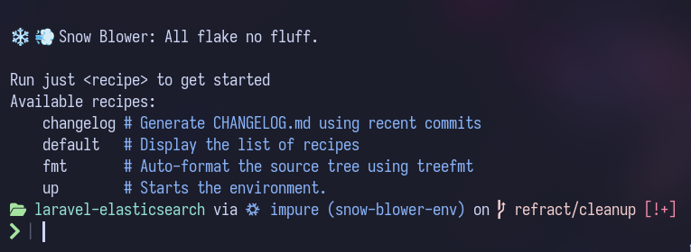
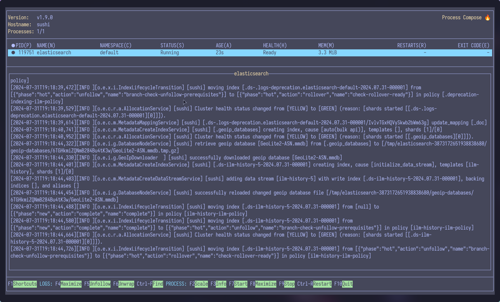

# Contribution Guide

## Setting up the project

### Nix Setup (With Flakes)

Pull down this project locally.

when you enter the directory if you have direnv installed run:

```sh
direnv allow
```

If you do not run

```sh
nix develop --impure
```

this will pull down all dependencies, install hooks and formatters etc. If done correctly you should see a screen like this:



### Development

During development, you will need to start a local elasticsearch instance. To start elasticsearch run:

```sh
just up
```

This will start process-compose and an elastic search instance.



You can now open a new terminal window and run tests using pest. For conviance purposes the nix shell has the command `p` linked to run `./vendor/bin/pest` and `pf` linked to run `./vendor/bin/pest --filter "$@"`.
